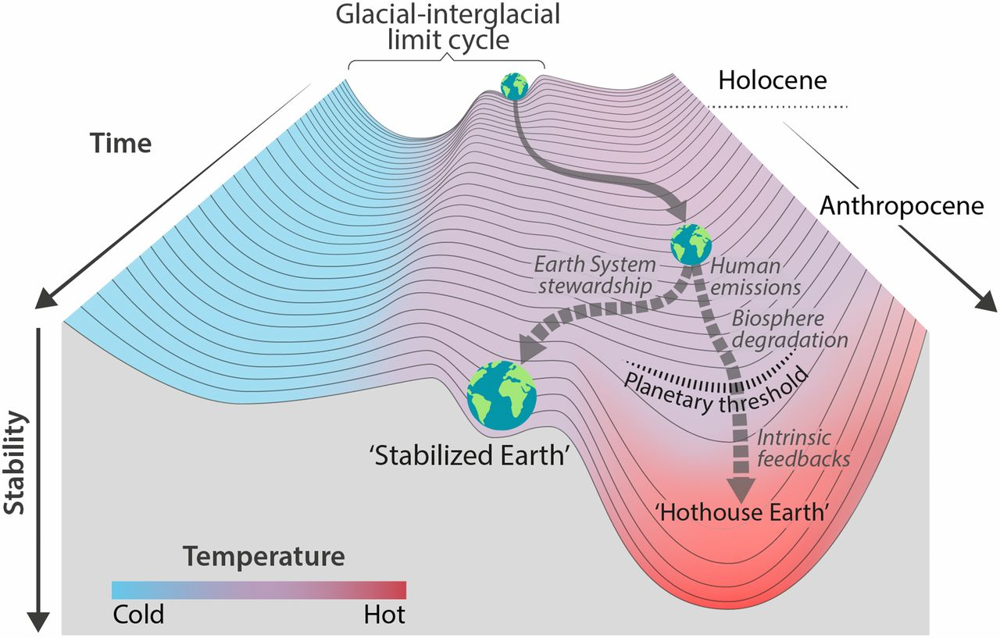

## Tomislav Medak
## PRP, Phase I
## 17 December 2018

!---!

# overview

I. Research project, objectives, PhD outline and target dates  <!-- .element: class="fragment" data-fragment-index="1" -->

II. Activities and deliverables in the current year  <!-- .element: class="fragment" data-fragment-index="2" -->

III. Objectives and plan for the next year  <!-- .element: class="fragment" data-fragment-index="3" -->

!---!

## I. RESEARCH PROJECT, OBJECTIVES,
## PHD OUTLINE AND TARGET DATES

!---!

# research project

## title:

*Disrupting technology - can the planetary technosphere be politically steered toward a post-capitalist social metabolism?*

!---!

# research project

## summary:

> ... structure: mechanisms that drive the development of technologies and accelerate the impact of technosocial processes on Earth's biophysical systems

> ...and agency: how disruption of technological systems can be an enabling factor for climate action, how various social actors can impact the direction of technological change and how technologies, particularly computers and digital networks, help produce climate science and disseminate science data, research and scholarly writing to the actors working in climate action

Note: In my PhD project I intend to theorize what are the **socially structured mechanisms** that drive the development of technologies and accelerate the **impact of technosocial processes on Earth's biophysical systems**. I'll look at how disruption of technological systems, particularly energy systems, **can be an enabling factor for climate action**, how various social actors can **impact the direction of technological change** toward a low-carbon, post-growth and post-capitalist economy, and finally **how technologies, particularly computers and digital networks, help produce climate science and disseminate science data, research and scholarly writing** to the actors working in climate action arena and to the public in general. I'm thus interested in the ambivalence: **how social agents can diminish technology's negative impact by benefiting from the access to data and publishing that the technology enables**.

!---!

# research project

## summary:

> ...three case studies:
> first, at the Institute for Political Ecology, an environmentalist group in Croatia;
> second, at a the Unite trade union in the UK;
> third, of academic community devising practices of no-barriers access to scientific publishing, data and information

> ...finally: seeking to contribute and strengthen the work of those communities.

Note: To expand my research empirically, I will conduct three case studies: first, at the Institute for Political Ecology, an environmentalist group in Croatia; second, at a the Unite trade union in the UK; third, of academic community devising practices of no-barriers access to scientific publishing, data and information. The aim is to undestand how environmental activism and union advocacy benefit from access to knowledge, and how access activists can provide vital information of public interest in cases of urgency. As I’m involved in both environmental and access to knowledge communities, and have worked with some of the groups I’ll be observing, my methodology will be community-based, seeking to contribute and strengthen the work of those communities.

!---!

# research project

## context: environmental humanities

 Steffen et al.: "Trajectories of the Earth System in the Anthropocene", 2018 

Note: My research falls into the emerging field of **environmental humanities**, a field that has largely sprung up in response to the anthropogenic disruption of Earth's biophysical system and consequences this will have on human societies. They are a critical revision of the **strict separation of human and natural sciences** that has been the hallmark of knowledge production since the 19th century. The defining characteristic of that separation is that it viewed **the natural history and the social history as external to each other**. Given that the nature and the society were assumed to be operating at very different temporal and spatial scales, they could be meaningfully analyzed by unrelated methods of inquiry. Yet with the acceleration of climate change, it has become alarmingly clear that human activities over centuries and millenia have been transforming Earth’s systems at an ever greater scale and that humanity has been increasingly dependent on ever greater adaptation of Earth’s systems to accommodate its growing hunger for energy and resources. My research draws from a variety of fields: environmental science, science and technology studies, political economy, critical theory and Earth science. In my approach I combine both the theories that look at the social structures as forms of causation and theories that look at the situated agency of various social actors at various scales.

!---!

# PhD objectives

Phase 1: develop an integrated analytical framework to understand technological development from the perspective of social structure and from the perspective of social agency <!-- .element: class="fragment" data-fragment-index="1" -->

Phase 2: conduct case studies of environmentalists, labour unions and scholarly communities <!-- .element: class="fragment" data-fragment-index="2" -->

Phase 3: write up my research, present back to these communities, and publish journal articles <!-- .element: class="fragment" data-fragment-index="3" -->

Beyond: inspite of a sense of despair surrounding climate change, provide a comprehensive, analytically grounded and political realistic assemsent for an urgent, transnational and transformative action  <!-- .element: class="fragment" data-fragment-index="4" -->

Note: **1. For the phase 1**, my objective is to conduct a literature review in sociology of technology and science, environmental science, political economy and political theory in order to develop an integrated analytical framework – one that understands technological development and its impact on evinromental systems both from the perspective of capitalist social structure and from the perspective of plural field of social agency. A particular focus of my analysis will be on energy systems and cybernetic systems. **2. In the phase 2**, deploying this analytical framework, I will conduct case studies that will empirically examine - through field work postings and interviews - the forms of agency that environmentalists, labour organisations and scholars are envisioning in regulating and using technological systems in order to make the transition into a post-growth, low-carbon, post-capitalist economy. Of particular interest are visions these actors have of how digital technologies can re-orient the technological change to make that systemic change feasible. **3. In the phase 3**, during my research work and after its completion, through initial presentations to these collective actors, journal articles and presentations at international events, I will ensure that my findings contribute critically and affirmatively to the efforts of these collective actors. **4. Beyond: The ultimate objective of my research is, in a situation of likely runaway climate change, marked by an growing sense of disorientation and despair, to provide a comprehensive, analytically grounded and political realistic assessment if and how can an urgent, transnational and transformative action be organised to avert worse consequences.

!---!

# PhD outline & target dates
Phase 1 (by the latter part of January 2019):

> II. Literature review: Technologies and environmental crisis (chapters 2 & 3)
>  1. Technological development and the rise of fossil capital (*done as PHD1.1 submission*)
>  2. Technosphere and agency (*done as PHD1.2 and PHD1.3 submissions*)

Note: My PhD research so far following the targets set in the initial phase of my research. Also, writing of my PhD follows stages of my work: literature review (phase 1), fieldwork and analysis (phase 2), participant’s feedback, write-up and publication (phase 3). As part of phase 1, I have already completed first drafts of my literature review chapters on fossil capitalism (PHD1.1) and technosphere and agency (PHD1.2 and PHD1.3).

!--!

# PhD outline
Phase 1 (currently working on):

>III. Methodology of research (chapter 4)
>  1. Community-based participatory action research: researching and working with the actors
>  2. Interdisciplinarity and 'post-normal' science
>  3. Expertise and collective agency

!--!

# PhD outline
Phase 2 (by the latter part of January 2020):

> IV. Case studies (chapters 5 & 6)
>  1. Institute for Political Ecology: advocating de-carbonization and access to data in the semi-periphery
>  2. Tade Unions: Labor at the Center of Climate Action
>  3. Radical Open Access: radicalizing open access and urgency of agency

Note: In the phase 2, I intend to conduct the case studies. This will be done through the analysis of secondary sources, open-ended interviews and participatory observation. In that period, I’ll also complete three draft chapters of my PhD.

!--!

# PhD outline
Phase 3 (by the latter part of January 2021):

> rewrite of earlier chapters    
>   I. Introduction (chapter 1)   
>   V. Participants' feedback (chapters 7 & 8)   
>   VI. Conclusions (chapter 9)

Note: In the phase 3, I intend to commit to writing-up and publishing my research. I’ll re-vise, extend and finalise chapters written earlier, as well as write three new chapters, completing my thesis.

!---!

## II. ACTIVITIES AND DELIVERABLES
## IN THE CURRENT YEAR

!---!

# PhD so far

II. Literature review: Technologies and environmental crisis

1. Technological development and the rise of fossil capital (chapter 2)

2. Technosphere and agency (chapter 3)

!---!

# taught modules

1. Induction:
  - M001RDC: Introduction to Research Design and Writing  
  mark: 70.00 (10 credits)  

2. Subject specific:
  - M112GED Clean Energy, Climate and Carbon  
  mark: 69.68 (15 credits)

!---!

# PGR development: articles

- "Against Innovation: Compromised Institutional Agency and Acts of Custodianship", co-authored with Marcell Mars, peer-reviewd, forthcoming in *Ephemera - Theory & Politics in Organisation*

- book chapter: “Estetizacija tehnopolitike” (“Aestheticisation of Technopolitics”), forthcoming in 2019 with the Zagreb Faculty of Arts and Humanities Press

!---!

# PGR development: articles

- introduction to the Croatian translation of Andreas Malm’s *Fossil Capital*, co-authored with Mladen Domazet, Fraktura, 2018

- book chapter “Learning from the #Syllabus”, co-written with Valeria Graziano and Marcell Mars, for *State Machines Reader*, forthcoming in 2019 with the Institute for Network Cultures

!---!

# PGR development: talks

!---!

# PGR development: talks

- presentation at the symposium “Shadows of the Dawn: Migration and the Indeterminacy of Community and Immunity”, Brunel University, 8 April

- peer-revied presentation “Transformation of the Technosphere and the Critical Agency of the Degrowth Movement”, 6th Int. Degrowth Conference, Malmö, 24 August

- talk “Against all Odds: Can we Transform the Global Technosphere to Prevent Extreme Climate Change”), Green Academy summer school, Vis, 26 August

!---!

# PGR development: talks

- panel presentation “Scale and Structure: Planetary Technology and Sited Agency”, Digital Cultures conference, Lüneburg, 21 September

- peer-reviewed presentation “The Aestheticization of Technopolitics: The Internet, the Far Right and the Warming Planet”), 15th annual Historical Materialism conference, London, 10 October

- panel presentation and a workshop at the “Out of the Shadow - Alternative Modes of Knowledge Production, Conservation and Distribution” event, Global Emergent Media Lab, Concordia University, Montreal, 21-22 November

!---!

# PGR development: website

set up my academic own web site  
(plaintext+static website generator)    
http://tom.medak.click

!---!

# PGR development: editing

- edited *Guerilla Open Access* panel pamphlet, together with Marcell Mars, May-June

!---!

# PGR development: organising

- organised Guerilla Open Access panel at the Radical Open Access 2 conference, together with Marcell Mars, 27 June

- organised Safe Havens for Datasets and Politics of Technological Interventions workshops, together with Marcell Mars, 27-28 June

!---!

## III. OBJECTIVES AND PLANS
## FOR THE NEXT YEAR

!---!

# objectives & plans

| period | activity |
|--|--|
| by mid January | finish the fourth chapter on methodology (participatory action research, 'post-normal' science and collective agency) |
| February-June | field work at the Institute for Political Ecology in Zagreb |
| March-May | Working/conference paper: Open knowledge infrastructures and advocacy for post-capitalist transition |
| July | PHD2.1 submission, the case study chapter on Institute for Political Ecology |

!---!

# objectives & plans

| period | activity |
|--|--|
| July-December | fieldwork at the Unite trade union, participant observation at the Coventry University’s open access community |
| November-December  | PHD2.2 submission, drafting of the second and third case study chapters  |
| December | PRP Phase 2 |

Note: In 2019 I plan to complete the Phase 1 work on the chapter on methodology. With the initial draft of the analytical framework thus done, from February on I intend to conduct three case studies that will empirically examine - through fieldwork, open-ended interviews and participant observation - the forms of agency that environmentalists, labour organisations and scholars are pursuing. I hope to be done with empirical work by the end of phase 2, as well as the initial write-up of the case study chapters.
